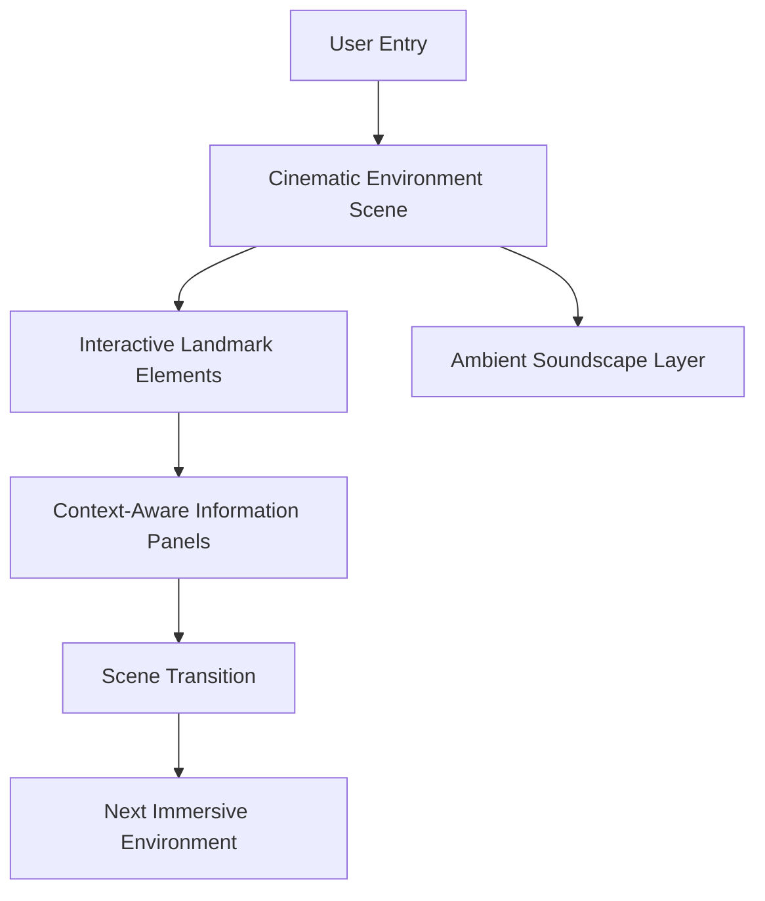

# Journey Through Japan — Immersive Cultural E-Learning Platform


## Project Overview

**Journey Through Japan** is an immersive digital cultural exploration platform that reimagines how users experience cultural heritage through interactive storytelling, cinematic environments, and modern web technologies.

Rather than presenting information through conventional webpages, the platform guides users through a sequence of carefully designed interactive worlds inspired by significant Japanese landmarks. Each environment combines visual atmosphere, environmental audio, and contextual information to create an engaging and educational experience.

The project is currently under active development. The original design is available at the [Figma project](https://www.figma.com/design/7eOkwDuMnDeLEx4AyNGsXo/Japan-E-Learning-Website).

---

## Concept Statement

Traditional e-learning and cultural-heritage websites tend to present information as static pages of text and images. This approach can lead to:

* Low user engagement
* Poor retention of cultural context
* Lack of emotional connection to the subject matter
* A generic browsing experience disconnected from the material
* Difficulty conveying atmosphere, scale, and place

This project uses cinematic environments, layered audio, and contextual information panels to let users explore Japanese landmarks so that learning feels closer to a guided journey than a lookup exercise.

---

## Key Features

### Immersive Environment Design

* Cinematic full-screen environments for each landmark
* Interactive cultural landmarks users can explore directly
* Smooth scene-to-scene transitions
* Premium, consistent visual design system

### Context-Aware Learning

* Context-aware information panels that surface historical and cultural detail without interrupting immersion
* Experience-first structure: users encounter the environment before the information
* Designed to feel closer to a museum installation than a traditional website

### Atmospheric Presentation

* Atmospheric environmental effects
* Ambient soundscapes tied to each location
* Responsive interface across devices

### Modern Web Architecture

* Built with React and TypeScript for a maintainable component structure
* Vite-powered development and build pipeline
* Tailwind CSS for a consistent design system
* Animation layer built on Motion, with GSAP planned

---

## What This Project Demonstrates

This project is designed to show practical frontend engineering and interaction design skills:

* Interactive, narrative-driven UI design
* Component-based architecture with React and TypeScript
* Animation and motion design for immersive interfaces
* Environmental audio integration planning
* Cultural content presentation and information architecture
* Scalable project structure for multi-scene experiences
* Modern frontend tooling and build configuration

---

## Tech Stack

| Layer               | Tools Used                          |
| -------------------- | ------------------------------------ |
| Frontend Framework   | React, TypeScript                    |
| Build Tool           | Vite                                  |
| Styling              | Tailwind CSS                         |
| Animation            | Motion (GSAP planned)                |
| Planned 3D / WebGL   | Three.js, React Three Fiber, WebGL   |
| Planned Audio        | Web Audio API                        |
| Design Source        | Figma                                |

---

## Project Structure

```bash
ImmersiveJapanStorytellingWebsite/
│
├── src/
│   ├── assets/
│   ├── components/
│   ├── pages/
│   ├── hooks/
│   ├── styles/
│   └── utils/
│
├── App.tsx
├── package.json
└── README.md
```

---

## System Architecture



---

## Current Scope

The initial release focuses on five interactive environments representing iconic locations across Japan:

| Environment                     | Description                                             |
| -------------------------------- | -------------------------------------------------------- |
| Itsukushima Shrine               | Coastal shrine environment with tide-based atmosphere    |
| Arashiyama Bamboo Forest         | Dense bamboo grove with light-filtering visual effects   |
| Traditional Japanese Temple      | Historic temple setting with cultural context panels     |
| Mount Fuji                       | Large-scale landscape environment                        |
| Sakura Garden                    | Seasonal garden environment with ambient soundscape       |

Each environment is designed as an independent immersive scene connected through a continuous narrative experience.

---

## Design Principles

The platform is built around five guiding principles:

* Experience before information
* Cultural authenticity
* Cinematic storytelling
* Minimal interface design
* Environmental immersion

Every design decision prioritizes atmosphere, readability, and user engagement while maintaining a refined and consistent visual language.

---

## How to Run Locally

### 1. Clone the Repository

```bash
git clone https://github.com/DrishaantSarkar/ImmersiveJapanStorytellingWebsite.git
cd ImmersiveJapanStorytellingWebsite
```

### 2. Install Dependencies

```bash
npm i
```

### 3. Start the Development Server

```bash
npm run dev
```

### 4. Open in Browser

The development server will provide a local URL in the terminal output (typically `http://localhost:5173`).

---

## User Journey Workflow

When a visitor loads the platform:

1. The user is presented with a cinematic full-screen environment.
2. Environmental audio and visual effects establish atmosphere and place.
3. The user interacts directly with landmark elements in the scene.
4. Context-aware information panels reveal historical and cultural detail as needed.
5. A smooth transition carries the user into the next immersive environment.
6. The narrative continues across the full sequence of locations.

---

## Key Design Outcomes

This project explores how to:

* Present cultural and historical content without relying on static text-heavy pages
* Balance visual atmosphere with informational clarity
* Sequence multiple immersive scenes into one coherent narrative
* Layer ambient audio with visual storytelling
* Maintain performance and responsiveness across an animation-heavy interface

---

## Educational / Cultural Impact

This platform is intended to help learners and visitors:

* Engage more deeply with cultural heritage content
* Retain historical and contextual information through experiential learning
* Explore landmarks they may not otherwise have access to
* Encounter Japanese culture through atmosphere rather than text alone
* Build interest in further cultural or historical exploration

---

## Deliverables

| Deliverable            | Purpose                                              |
| ----------------------- | ----------------------------------------------------- |
| Figma design source     | Visual and interaction design reference               |
| React/TypeScript codebase | Implementation of interactive environments           |
| Component library        | Reusable UI and scene components                      |
| Design system             | Consistent visual language across environments        |

---

## Future Improvements

Planned improvements:

* Integrate Three.js and React Three Fiber for 3D environments
* Add WebGL-based visual effects
* Implement Web Audio API for dynamic environmental soundscapes
* Expand GSAP-based animation sequences
* Add additional landmark environments beyond the initial five
* Add accessibility features for reduced-motion and screen-reader support
* Add localization support for multiple languages
* Deploy a public live version of the platform

---

## Development Status

The project is currently in active development. The present milestone focuses on establishing the visual language, interaction model, and first immersive environment before expanding to the complete collection of cultural experiences.

---

## Why This Project Stands Out

This project is more than a standard informational website. It combines:

* Interactive storytelling
* Cinematic environment design
* Frontend engineering with React and TypeScript
* Cultural heritage presentation
* Ambient audio and visual atmosphere design
* A scalable, scene-based architecture

It shows the ability to turn a design concept into an engaging, narrative-driven web experience rather than a conventional page-based site.

---

## Authors

**Pragyan Singh**
GitHub: [Pragyan2428](https://github.com/Pragyan2428)

**Drishaant Sarkar**
GitHub: [DrishaantSarkar](https://github.com/DrishaantSarkar)

---

## License

This repository is currently under development. Licensing terms will be added as the project matures.
